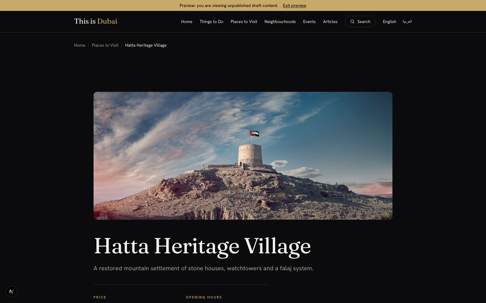

> **Copy final, pending screenshots before posting.** Written from a delivery and architecture
> point of view: the mechanics and the decisions, not a code dump. The previewed-page shot is
> embedded; capture the one remaining CMS-editor 📷 shot (the Share panel) before publishing.
> Companion to the broader piece, "Shareable
> stakeholder previews on Optimizely SaaS CMS" (linked at the end); this one zooms into a single
> question people keep asking me: what is that link, really, and how does it stay safe?

## The one button, and the question behind it

The feature looks trivial from the outside. An author is reviewing an unpublished page inside the
CMS, clicks one button, picks a couple of options, and gets a link. They paste it into an email, a
stakeholder with no CMS login opens it, and they see the draft exactly as it will look once
published. No account, no VPN handshake at the CMS, no screenshots pasted into a document.

📷 **[Screenshot to capture (CMS editor)]** The "Share with a stakeholder" panel, with the "Who can open it" selector on "Internal, organization network only", the "Shows" and "Expires after" options, and a generated link with a Copy button.

Simple to use, and that is the point. But the moment you build it, a series of harder questions
arrive, and they are the questions this post answers:

1. What is inside that link?
2. Where is it stored? Is there a database of live links somewhere?
3. Will a link ever stop working, and why?
4. How do you stop the wrong person opening it?

The short version: the link is a signed, self-describing claim that lives nowhere on the server. It
is validated fresh on every request, it expires on a clock baked into itself, and access is scoped
to a network by default. Let me unpack each part.

## What is inside the link: a signed claim, not a secret

The token on the end of that URL is not a random string that points at a row in a table. It is the
data itself, carried in the open, with a tamper-proof seal. Conceptually it is two pieces joined by
a dot:

```
token = base64url(payload) + "." + base64url( HMAC_SHA256(payload, SIGNING_SECRET) )

payload = {
  "key":     "898d9f7babfb1e1de88185c34c015922",   // which content item this link may show
  "locale":  "en",
  "version": "latest",                              // "latest" tracks edits; a number pins a snapshot
  "path":    "/events/hero-dubai-desert-classic/",  // where to land the reviewer
  "mode":    "internal",                            // access mode (more on this below)
  "exp":     1787118674                             // expiry, as epoch seconds
}
```

Two properties matter more than anything else here.

**It is signed, not encrypted.** The payload is base64url-encoded JSON, so anyone can read it. That
is fine and intentional. The claims are not secret: knowing that a link points at an event page
until next Tuesday tells an attacker nothing useful. What must not be forgeable is the *content* of
those claims. The signature (an HMAC computed with a server-only secret) is what guarantees nobody
edited the payload. Flip `mode` from `internal` to `shareable`, or push `exp` a year into the
future, and the signature no longer matches, so the request is refused. You cannot escalate a link
by editing its URL.

**The token grants no data access on its own.** This is the line I would underline twice. The token
authorizes the server to *render one draft item until a deadline*. It does not carry, and cannot be
turned into, the credential that actually reads unpublished content from the CMS. That credential (a
privileged key that can read drafts from the content graph) stays on the server and never travels to
the browser. The token is a permission slip, not a key to the vault.

## Where the link is stored: nowhere you would expect

This is the question I get asked most, usually phrased as "so where is the database of links?" There
isn't one.

| Location | What lives there | How long it lasts |
|---|---|---|
| The share URL (`?token=...`) | the token, while the author sends it | only wherever the author pastes it |
| The reviewer's browser cookie | the same token, set after they open the link (http-only, secure) | until the token's own expiry |
| A second browser cookie | a "draft mode is on" flag with no payload | same lifetime |
| A database | nothing at all | there is no database |

The design is deliberately **stateless**. The token is minted, handed out, and from then on the
server keeps no record of it. When a reviewer opens the link, the server does two things: it verifies
the signature and expiry, then it writes the token into an http-only cookie so the reviewer's browser
presents it automatically on every subsequent page view. Every one of those page views re-verifies
the token from scratch. Nothing is ever "looked up" in a store, because there is no store.

That statelessness buys a lot: no table to migrate, no rows to garbage-collect, no shared database
between the CMS and the front end, and horizontal scaling for free because any server can validate
any link with only the shared secret. It also has one honest cost, which I cover under revocation
below.

## The full lifecycle, in one diagram

Here is the whole journey, from the author's click to the moment the link goes cold. It is worth
reading top to bottom once.

```
 AUTHOR (inside the CMS editor)         THE FRONT-END APP                        REVIEWER
 ─────────────────────────────         ─────────────────                        ────────
 Reviewing a draft; the CMS
 shows it inside the app's
 preview route (authenticated
 by the CMS's own short-lived
 preview token, not ours)
        │
        │ clicks "Share",
        │ picks Internal + 7 days
        ▼
   generate-link step   ──►  re-checks the CMS preview token,
   (runs on the server)      then signs a token:
        │                    { key, locale, version, path,
        │                      mode: "internal", exp: now + 7 days }
        ▼
   https://app/preview/share?token=eyJ...   ── emailed ──►   opens the link
                                                                   │
                                                  ┌────────────────▼─────────────────┐
                                                  │ EDGE GATE (runs on every request) │
                                                  │  read mode from the token         │
                                                  │  is it "internal"?                │
                                                  │    yes: is the client IP allowed? │
                                                  │        no  -> 403, stop here       │
                                                  └────────────────┬─────────────────┘
                                                                   │ allowed
                                                  ┌────────────────▼─────────────────┐
                                                  │ CONSUME THE LINK                  │
                                                  │  verify signature + expiry        │
                                                  │  turn draft mode on               │
                                                  │  store token in an http-only cookie│
                                                  │  redirect to the real page URL    │
                                                  └────────────────┬─────────────────┘
                                                                   ▼
                                                        browses the draft page(s)
                             ┌────────────────────────────────────────────────────────┐
                             │ EACH page view re-checks, statelessly:                   │
                             │   1. the edge network gate, again                        │
                             │   2. verify the token from the cookie (signature + expiry)│
                             │   3. does the token's key match THIS page? (scope check)  │
                             │   4. read the draft using the server-only CMS credential  │
                             └────────────────────────────────────────────────────────┘
                                                                   │
                                        token expires  ->  cookie is dropped, verify fails,
                                        the reviewer simply sees the normal published site
```

📷 **[Optional figure]** The flow diagram above, exported as a clean image for the post (the ASCII version reads fine as-is if you would rather skip it).

Notice that the network gate and the signature check run on *every* request, not just when the link
is first opened. A reviewer who opened a link on the office network and then wandered off it does not
keep access, because the very next page view is re-checked.

## Two ways to open it: Internal versus Shareable

Look again at the top control in the screenshot, "Who can open it". This is the access model, and it
is the part I would encourage every team to think about before shipping.

- **Internal (organization network only).** The default. The link opens only from an allow-listed
  set of network addresses (your office egress, your VPN). This is the right default for day-to-day
  review by colleagues, because it means a link that leaks out of an inbox is inert to anyone off the
  network.
- **Shareable (anyone with the link).** An explicit opt-in for the genuine external case: a
  stakeholder who has no CMS login and is not on your network. You choose this consciously, per link.

Making Internal the default is a small product decision with a large security payoff. The most common
failure mode for these links is not a clever attacker; it is an email forwarded one hop too far. If
the safe option is the one authors get without thinking, the accident stops being dangerous.

Crucially, the choice is written into the signed payload as that `mode` claim, so it cannot be
changed after the fact. A recipient cannot turn an Internal link into a Shareable one by editing the
URL, because that would break the signature.

## How the network gate works, and one deliberate strictness

The gate lives at the edge, in front of the app, so an off-network request is turned away before any
draft is ever read. The rule set is intentionally small:

1. If the link is Shareable, let it through. The gate only applies to Internal links.
2. If the link is Internal, compare the caller's network address against an allow-list held in
   configuration (an environment value, comma-separated), for example:

   ```
   PREVIEW_ALLOWED_IPS=203.0.113.10,198.51.100.4
   ```

3. On the list, continue. Off the list, return 403 immediately.

Two design choices inside that are worth calling out, because they are the difference between a gate
that feels safe and one that actually is.

**Fail safe, not fail open.** If the allow-list is empty or misconfigured, the gate denies Internal
links rather than allowing them. A broken deployment should lock the door, not leave it open. The
same instinct applies throughout: if the signing secret is missing, the system refuses to mint or
verify anything, rather than falling back to something weaker.

**Trust only the address your own infrastructure stamps.** The caller's network address arrives in a
forwarding header, and that header is only trustworthy if a proxy you control rewrites it. Read the
hop your platform sets, and do not trust an address a client could have typed in themselves.
Otherwise the allow-list is theatre, because anyone can claim to be on your network.

## The localhost trap: a real debugging story

I will leave in the exact moment this bit us, because it teaches the model better than any
explanation. During testing we connected to the office network, opened an Internal link, and got a
403. The instinct was "the gate is broken". It was not. The link was being opened against a local
development server, at `localhost`.

A request to `localhost` is a loopback: it never leaves the machine, so it never travels out to the
network and back. That means it carries no forwarding header at all, and your real, public network
address, VPN or not, is nowhere in the request. The server sees a local connection, not your office
address. So the office address on the allow-list can never match a request you make to your own
laptop.

The lesson generalizes: the network allow-list only means anything once the app sits behind a proxy
that stamps the real client address, which is to say, once it is deployed. On a developer's machine
you are always "local", regardless of what network you are on. We made the local behaviour strict on
purpose (local requests are treated as loopback and must themselves be allow-listed to pass), so that
the deny path can be exercised from a normal browser during testing, instead of only ever behaving
one way in development and another in production. If you build this, decide that local rule
consciously, and write it down, because someone will hit exactly this and file a bug against a
feature that is working correctly.

## When a link stops working

Because the token is self-describing, its death is built in rather than managed. There are five ways
a link goes cold:

1. **It expires.** The deadline is signed into the token when it is created (the panel offers 24
   hours, 7 days, 30 days). After that moment, verification fails and the link returns a clear "this
   preview has expired" response. Because the deadline is signed, it cannot be extended without
   issuing a new link.
2. **The cookie drops itself.** The browser cookie that carries the token is given the same lifetime
   as the token, so it disappears exactly when the token dies. There is no stale state left behind.
3. **The reviewer exits preview.** An explicit exit action clears the cookie and turns draft mode
   off, returning the browser to the normal published site.
4. **The network gate blocks it.** A perfectly valid Internal link still returns 403 from an address
   that is not allow-listed. Validity and access are two separate checks.
5. **You rotate the signing secret.** Change the server-side secret and every token ever issued
   fails its signature check at once. This is the emergency "revoke everything" lever.

That last point exposes the one honest cost of a stateless design: you **cannot revoke a single link**
without rotating the secret, which invalidates all of them. There is no per-link off switch, because
there is no record of individual links to switch off. For most stakeholder-review use cases this is a
fair trade, and you lean on the short expiry, the single-item scope, and the network gate to keep the
blast radius small. If per-link revocation ever becomes a hard requirement (embargoed content, a
regulated workflow), that is the precise moment to add a small stored deny-list of revoked token
identifiers, and accept the state you were previously avoiding. Do it when the requirement is real,
not before.

## The security posture, in one paragraph

Put together, the model is layered rather than reliant on any single control. The token is signed so
it cannot be forged or escalated. It is scoped to one content item, so a reviewer who navigates
elsewhere sees only published pages. It is short-lived, so a leak has a deadline. It is
network-gated by default, so a leaked Internal link is inert off the network. And it carries no
privileged credential, so even a fully valid token never becomes a way to read arbitrary drafts, only
the one item it was minted for. No layer is doing all the work, which is exactly what you want.

## How we built it, and what I would keep

If you are implementing this on a headless CMS with a modern front-end framework, here is the shape I
would repeat, distilled to the decisions rather than the code.

- **Make the token self-contained and signed, not a database key.** Statelessness removes an entire
  category of operational work and lets any server validate any link. Reach for stored state only
  when you genuinely need per-link revocation.
- **Sign, do not encrypt, and keep the claims boring.** Put only what you need in the payload: which
  item, which locale and version, where to land, the access mode, and the expiry. Nothing sensitive
  belongs in a token a user holds.
- **Bake the access decision into the signed payload.** The Internal-versus-Shareable mode has to be
  a signed claim, or the URL becomes editable into a more permissive link.
- **Default to the safe option.** Internal by default, Shareable by explicit choice. The common
  accident (a forwarded email) should land on the locked door.
- **Enforce access at the edge, and on every request.** Gate the link when it is opened and on each
  subsequent page view, so access cannot outlive the network condition it depended on.
- **Fail closed everywhere.** No secret, no minting. No allow-list, no Internal access. A broken
  configuration should be safe, not open.
- **Scope every render to the one item the link names, and never cache draft reads.** A shared cache
  keyed only on the URL will happily serve an unpublished draft to the public. Draft reads must go
  straight to the source and stay out of any shared cache.
- **Keep the draft-reading credential on the server, always.** The token is a permission slip; the
  key that reads unpublished content is a separate, server-only secret that never reaches the browser.
- **Authenticate the "create link" action with something the author already has.** In our build the
  generator trusts the CMS's own short-lived preview session, so there is no new password for authors
  and no admin screen to protect. The author is already signed into the CMS; that is the credential.
- **Write down the localhost rule.** Decide how local development behaves, on purpose, and document
  it, so the loopback trap above becomes a footnote instead of a bug report.



## Closing

The satisfying thing about this feature is how little it leaves behind. There is no table of links to
maintain, no background job to expire them, no sync between two systems. A link is a signed sentence
that says "show this one draft, to someone on this network, until this time", and the system simply
reads that sentence, honestly, on every request, until the clock runs out. Get the defaults right,
fail closed, and keep the real credential on the server, and a one-click share button turns out to be
a small, well-behaved piece of security engineering rather than a liability.

## Related

- "Shareable stakeholder previews on Optimizely SaaS CMS (headless): login-free links to unpublished
  content" (the broader architecture and delivery story, and the traps we hit building it).
- "Live Visual Builder preview with Next.js" (the author-facing, in-editor preview that sits alongside
  this shareable one).
- "Security best practices with Optimizely SaaS CMS (headless)" (HMAC key handling, secret hygiene,
  and the back-end-for-front-end boundary).
